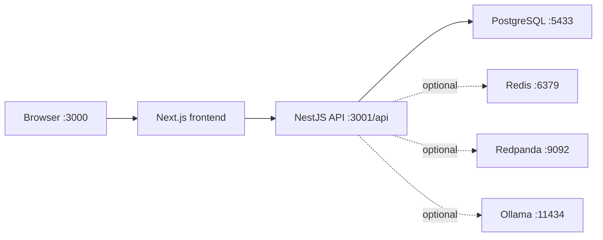

# TechPotli OS — Local Development Guide

This guide explains how to run **TechPotli Business OS** on your Windows machine from scratch.

## What you are running

| Service | Port | Folder | Purpose |
|---------|------|--------|---------|
| PostgreSQL (embedded) | **5433** | `backend/` | Database — leads, customers, invoices, etc. |
| Backend API (NestJS) | **3001** | `backend/` | REST API + WebSocket notifications |
| Frontend (Next.js) | **3000** | `frontend/` | Web dashboard you open in the browser |



---

## Prerequisites

Install once on your PC:

1. **Node.js 20+** — [https://nodejs.org](https://nodejs.org) (LTS)
2. **Git** (optional, if cloning the repo)

You do **not** need Docker for basic local dev. The project includes an embedded PostgreSQL starter.

**Optional (for background jobs):**
- **Redis** — for cron reminders (follow-ups, renewals). Without Redis, login and CRM still work.

---

## First-time setup (one time only)

Open **PowerShell** and run from the project root `c:\Crm\techpotli-os`:

### Step 1 — Backend dependencies

```powershell
cd c:\Crm\techpotli-os\backend
npm install
```

### Step 2 — Environment file

Copy the example env file if you don't already have `backend\.env`:

```powershell
copy .env.example .env
```

The default `DATABASE_URL` points to port **5433** (embedded Postgres).

### Step 3 — Frontend dependencies

```powershell
cd c:\Crm\techpotli-os\frontend
npm install
```

Create `frontend\.env.local` if missing:

```env
NEXT_PUBLIC_API_URL=http://localhost:3001/api
```

---

## Option A — One-command start (no Docker)

Best for Windows local dev. Opens 3 terminals automatically (DB → API → Frontend):

```powershell
cd c:\Crm\techpotli-os
.\scripts\start-local.ps1
```

AI lead scoring, email drafts, and FTS search work immediately (rule-based AI when Ollama is not installed). Install [Ollama](https://ollama.com) separately for full LLM features.

---

## Option B — Docker Compose (full modern stack)

Requires Docker Desktop. Runs PostgreSQL (pgvector), Redis, Redpanda (Kafka), Ollama, Nginx load balancer, 2 API replicas, worker, Prometheus, and Grafana:

```powershell
cd c:\Crm\techpotli-os
docker compose up --build
```

| Service | URL |
|---------|-----|
| App (via Nginx) | http://localhost |
| API health | http://localhost/api/health |
| Swagger docs | http://localhost/api/docs |
| Grafana | http://localhost:3002 (admin / admin) |
| Prometheus | http://localhost:9090 |
| Ollama | http://localhost:11434 |

Pull AI models once (first time):

```powershell
docker exec techpotli-ollama ollama pull llama3.2
docker exec techpotli-ollama ollama pull nomic-embed-text
```

---

## Option C — Every day — start the app (3 terminals)

You need **3 separate terminal windows**. Start them in this order.

### Terminal 1 — Database (keep open)

```powershell
cd c:\Crm\techpotli-os\backend
npm run db:start
```

Wait until you see:

```
PostgreSQL is running (no Docker required)
Port:     5433
```

**Leave this terminal open.** Press `Ctrl+C` here only when you want to stop the database.

---

### Terminal 2 — Backend API

**First time only** (after cloning or schema changes):

```powershell
cd c:\Crm\techpotli-os\backend
npm run db:migrate
npm run db:seed
```

**Every time:**

```powershell
cd c:\Crm\techpotli-os\backend
npm run start:dev
```

Wait until you see:

```
TechPotli API running on http://localhost:3001/api
```

Test in browser: [http://localhost:3001/api/health](http://localhost:3001/api/health)  
Should return JSON like `{"status":"ok",...}`.

---

### Terminal 3 — Frontend

```powershell
cd c:\Crm\techpotli-os\frontend
npm run dev
```

Open in browser: [http://localhost:3000](http://localhost:3000)

---

## Login credentials

| Role | Email | Password |
|------|-------|----------|
| Super Admin | `admin@techpotli.com` | `Admin@123` |

Use this account to access all modules (Settings, Approvals, Employees, etc.).

---

## What to try after login

| Workflow | Path |
|----------|------|
| Add a lead | **Leads** → + New Lead |
| Log a sales call | Open lead → **Log call / activity** |
| Convert to customer | Lead detail → **Convert to Client** |
| Full customer profile | **Customers** → open customer → tabs (Services, Documents, etc.) |
| Create project | Customer or **Projects** → + New Project |
| Client portal link | Customer detail → **Copy portal link** |
| Approve quotation (client) | Share `/quote/approve/[token]` link |

---

## Optional — Redis and cron jobs

Background jobs (lead follow-up reminders, renewal alerts, quotation expiry) need Redis.

### Start Redis (Docker)

```powershell
docker run -p 6379:6379 redis:7-alpine
```

### Enable cron in `backend\.env`

```env
ENABLE_CRON_JOBS=true
REDIS_URL=redis://localhost:6379
```

Restart the backend (`npm run start:dev`). On startup you should see:

```
Cron jobs enabled (ENABLE_CRON_JOBS=true)
```

Without Redis, you will see a warning but the API still runs for normal CRM use.

---

## Common problems

### "Network Error" on login page

- Backend is not running → start Terminal 2 (`npm run start:dev`)
- Use **http://localhost:3000** (not the LAN IP like `10.x.x.x:3000`) — cross-origin requests can fail with "Network Error"
- Recommended `frontend\.env.local` (same-origin proxy — avoids CORS):

```env
NEXT_PUBLIC_API_URL=/api
API_PROXY_TARGET=http://localhost:3001
NEXT_PUBLIC_WS_URL=http://localhost:3001
```

Restart the frontend after changing `.env.local` (`Ctrl+C`, then `npm run dev`)

### `Can't reach database server at localhost:5433`

- Database is not running → start Terminal 1 (`npm run db:start`) **before** the backend

### `EADDRINUSE` port 3001 already in use

Another backend process is still running. In PowerShell:

```powershell
Get-NetTCPConnection -LocalPort 3001 -ErrorAction SilentlyContinue | ForEach-Object { Stop-Process -Id $_.OwningProcess -Force }
```

Then run `npm run start:dev` again.

### Frontend shows blank or old errors

Clear Next.js cache and restart:

```powershell
cd c:\Crm\techpotli-os\frontend
Remove-Item -Recurse -Force .next -ErrorAction SilentlyContinue
npm run dev
```

### `assignees.map is not a function` (fixed in codebase)

Restart the backend so new routes load. Kill port 3001 if needed (see above).

---

## Useful commands

| Command | Where | What it does |
|---------|-------|----------------|
| `npm run db:start` | backend | Start PostgreSQL on 5433 |
| `npm run db:migrate` | backend | Apply database migrations |
| `npm run db:seed` | backend | Seed admin user + defaults |
| `npm run start:dev` | backend | API with hot reload |
| `npm run dev` | frontend | Next.js dev server |
| `npx prisma studio` | backend | Visual database browser |
| `npm run build` | backend / frontend | Production build check |

---

## Project folders

```
techpotli-os/
├── backend/
│   ├── prisma/          # Database schema + migrations + seed
│   ├── src/             # NestJS API modules
│   ├── scripts/         # Postgres start script
│   └── .env             # Backend secrets (do not commit)
├── frontend/
│   ├── app/             # Next.js pages (dashboard, login, portal)
│   ├── components/      # UI forms, panels, kanban
│   └── .env.local       # API URL for browser
└── docs/
    └── LOCAL_SETUP.md   # This file
```

---

## Role-based access (local)

| Role | Sees in sidebar |
|------|-----------------|
| **EMPLOYEE** | Dashboard, Leads, Customers, Projects, Support |
| **ADMIN** | + Invoices, Quotations, Payments, Renewals, Reports, Employees |
| **SUPER_ADMIN** | + Expenses, Settings, Approvals |

Log in as `admin@techpotli.com` for full access during development.

---

## Need help?

1. Check all 3 terminals are running (DB → API → Frontend).
2. Hit [http://localhost:3001/api/health](http://localhost:3001/api/health).
3. If health fails, read the backend terminal error (usually DB or port conflict).
